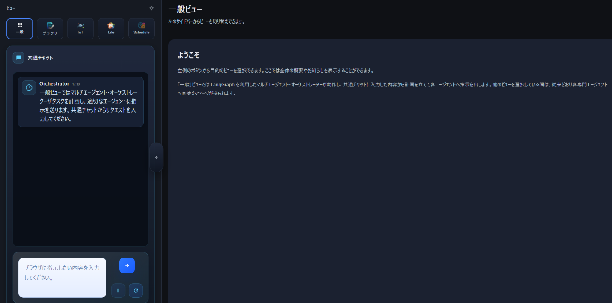

> 📖 日本語版はこのページの一番下にあります。

# 🎵 Symphony Agent Conductor

<div align="center">
  
  <p><strong>AI Agent Orchestra for You</strong></p>
  <p>
    
    
    
    
    
    
  </p>
</div>

Welcome to Symphony Agent Conductor!  
This is the command center that orchestrates capable AI agents (Browser automation, IoT, Schedule management, and more) to support your life and tasks.

Just talk to it in chat, and the agents will work together! 🤖✨

## UI Preview

<p align="center">
  
</p>

## 🎬 Demo Videos

The Browser Agent fetches weather information, the Scheduler Agent saves a weather memo, and the IoT Agent displays it on the screen.

Click a thumbnail to open the video on YouTube.

| [](https://youtu.be/jia_T6hgYSU) | [](https://youtu.be/1haaOgwXPLU) |
| --- | --- |
| What it actually looks like on screen | Agents in action |


---

## ✨ What can it do?

*   🗣️ **Chat Requests**: Give instructions naturally like "Check tomorrow's weather" or "Turn on the lights".
*   🌐 **Browser Automation**: Browses websites to gather information or perform actions on your behalf.
*   🏠 **Smart Home (IoT)**: Controls home appliances and checks room environments (temperature, etc.).
*   📅 **Schedule Management**: Leave schedule adjustments and confirmations to us.
*   🧠 **Memory**: Remembers conversation contents and your preferences, getting smarter over time.

## 🔬 Evaluation

### Evaluation Scenarios

10 scenarios were used, ranging from simple conversational responses to complex multi-agent coordination (web search + scheduling + IoT control).

| # | Task Overview | # Criteria |
|---|---|:---:|
| 1 | Respond to an abstract conversational message | 1 |
| 2 | Look up weekly weather using stored location + log the result | 2 |
| 3 | Find cheapest Tokyo→Atlanta weekday flight in Jan 2026 + add to calendar | 2 |
| 4 | Look up moonrise direction & time + schedule "moonbathing" + turn off lights | 3 |
| 5 | Check online evacuation manual + get shelter advice (Life-Style agent) + blink red LED | 3 |
| 6 | Suggest dinner recipe (health/allergy-aware) + add to task list + display "complete" | 3 |
| 7 | Find upcoming hobby-related events near user's location + schedule them | 3 |
| 8 | Find nearby restaurant serving user's favorite food + save as memo + display store name | 3 |
| 9 | Find picnic spot + get family planning advice + schedule for next Sunday + sound buzzer | 4 |
| 10 | Recognize and execute the user's predefined daily routine | 3 |

### Results

Memory-enabled conditions scored **~1.7× higher** than the no-memory baseline (max possible: 27 points).

| Condition | Score |
|---|:---:|
| No Memory (Baseline) | 15 / 27 |
| Persona 1 (with memory) | 24 / 27 |
| Persona 2 (with memory) | 26 / 27 |
| Persona 3 (with memory) | 25 / 27 |

<details>
<summary>Per-scenario breakdown</summary>

| Scenario | Baseline | Persona 1 | Persona 2 | Persona 3 | Max |
|:---:|:---:|:---:|:---:|:---:|:---:|
| 1 | 1 | 1 | 1 | 1 | 1 |
| 2 | 1 | 2 | 2 | 2 | 2 |
| 3 | 0 | 0 | 2 | 2 | 2 |
| 4 | 1 | 3 | 3 | 3 | 3 |
| 5 | 3 | 3 | 3 | 2 | 3 |
| 6 | 2 | 3 | 3 | 3 | 3 |
| 7 | 1 | 2 | 2 | 2 | 3 |
| 8 | 2 | 3 | 3 | 3 | 3 |
| 9 | 3 | 4 | 4 | 4 | 4 |
| 10 | 1 | 3 | 3 | 3 | 3 |
| **Total** | **15** | **24** | **26** | **25** | **27** |

</details>

### Key Observations

- **Memory dramatically improves ambiguous task handling** — stored user context (location, preferences, allergies, routines) enabled correct interpretation without needing to ask clarification.
- **Without memory**, the agent resorted to general assumptions or asked clarification questions (e.g., defaulted to Tokyo when location was unspecified).
- **Browser step count was not reduced by memory** — instead, memory caused more *verification steps* (checking details against user preferences). This is the desired behavior: higher output quality over raw speed.
- **Date interpretation can be inconsistent** — the Browser Agent occasionally searched 2024 data instead of 2025 due to the model's knowledge cutoff. Passing an explicit year in the prompt resolves this.
- **Scenario 3 (flight search)** consistently struggled with date-picker UIs on booking sites.

---

## 🚀 Get Started (Docker Compose)

If you have Docker, the concert (system) starts with a single command! 🎼

### 1. Preparation 🔑

First, write the API key that serves as the AI's brain into the configuration file.  
Copy `secrets.env.example` in the project folder to create a file named `secrets.env`, and fill in your actual API keys.

```bash
cp secrets.env.example secrets.env
```

**secrets.env**
```env
OPENAI_API_KEY=sk-proj-xxxxxxxx... (Your OpenAI API Key)
# Check secrets.env.example for other configurations
```

> 💡 **Note**: `secrets.env` is a secret key, so please do not show it to others or upload it to Git.

### 2. Launch 🐳

Run the following command in your terminal (command prompt).

```bash
docker compose up --build web
```

Various text will flow, like tuning instruments. Please wait a while.

### 3. Showtime! 🎭

When ready, access the following URL in your browser.

👉 **[http://localhost:5050](http://localhost:5050)**

If the screen appears, it's a success! Type "Hello!" in the chat box and enjoy interacting with the agents.

### 4. Stop (when you're done)

Press `Ctrl + C` in the terminal to stop the containers.

---

## 📚 Learn More

For detailed agent settings and development behind-the-scenes, please take a look at [AGENTS.md](AGENTS.md). Technical details and customization methods are written there.

---

<details>
<summary>日本語 (クリックして開く)</summary>

# 🎵 Symphony Agent Conductor

<div align="center">
  
  <p><strong>あなたのためのAIエージェント・オーケストラ</strong></p>
  <p>
    
    
    
    
    
    
  </p>
</div>

Symphony Agent Conductor へようこそ！  
ここは、様々な能力を持ったAIエージェントたち（ブラウザ操作、IoT、スケジュール管理など）を指揮し、あなたの生活やタスクをサポートする司令塔です。

チャットで話しかけるだけで、エージェントたちが連携して動いてくれます！ 🤖✨

## UI プレビュー

<p align="center">
  
</p>

## 🎬 デモ動画

ブラウザエージェントで天気情報を取得した後、スケジューラーエージェントが天気の情報をメモに残し、IoTエージェントがスクリーンに表示する様子です。

サムネイルをクリックすると YouTube で動画が開きます。

| [](https://youtu.be/jia_T6hgYSU) | [](https://youtu.be/1haaOgwXPLU) |
| --- | --- |
| 実際にスクリーンに表示される様子 | エージェントが動いている様子 |


---

## ✨ 何ができるの？

*   🗣️ **チャットでお願い**: 「明日の天気を調べて」「電気をつけて」など、自然な会話で指示を出せます。
*   🌐 **ブラウザ操作**: あなたの代わりにWebサイトを見て情報を集めたり、操作したりします。
*   🏠 **スマートホーム (IoT)**: 家電の操作や部屋の環境（温度など）の確認ができます。
*   📅 **スケジュール管理**: 予定の調整や確認もお任せあれ。
*   🧠 **記憶**: 会話の内容やあなたの好みを覚えて、どんどん賢くなります。

## 🔬 評価

### 評価シナリオ

シンプルな会話応答から，複数エージェントの連携（Web検索・スケジュール・IoT制御）を必要とする複雑なタスクまで，10種類のシナリオで評価しました．

| # | タスク概要 | 基準数 |
|---|---|:---:|
| 1 | 抽象的な発話への適切な返答 | 1 |
| 2 | メモリから居住地を特定し，週間天気を検索・記録 | 2 |
| 3 | 2026年1月の東京→アトランタ最安値便を検索し，カレンダーに登録 | 2 |
| 4 | 月の出の方角・時間を調査し，「月光浴」の予定登録→照明消灯 | 3 |
| 5 | 避難マニュアル確認→Life-Styleエージェントで助言取得→赤色LED点滅 | 3 |
| 6 | 健康・アレルギー配慮の夕飯レシピ提案→タスク追加→"complete"表示 | 3 |
| 7 | ユーザーの趣味に関連する近隣イベントを検索→スケジュール登録 | 3 |
| 8 | 好きな食べ物の近隣店舗を検索→メモ保存→店名をディスプレイ表示 | 3 |
| 9 | ピクニックスポット調査→家族会議の進め方助言→来週日曜に予定登録→ブザー鳴動 | 4 |
| 10 | ユーザー定義のルーティンを認識して順次実行 | 3 |

### 評価結果

メモリ機能を有効にすることで，ベースラインと比較してスコアが約 **1.7倍** 向上しました（最高スコア：27点）．

| 評価対象 | スコア |
|---|:---:|
| メモリなし（ベースライン） | 15 / 27 |
| ペルソナ1（メモリあり） | 24 / 27 |
| ペルソナ2（メモリあり） | 26 / 27 |
| ペルソナ3（メモリあり） | 25 / 27 |

<details>
<summary>シナリオ別スコア内訳</summary>

| シナリオ | ベースライン | ペルソナ1 | ペルソナ2 | ペルソナ3 | 最大 |
|:---:|:---:|:---:|:---:|:---:|:---:|
| 1 | 1 | 1 | 1 | 1 | 1 |
| 2 | 1 | 2 | 2 | 2 | 2 |
| 3 | 0 | 0 | 2 | 2 | 2 |
| 4 | 1 | 3 | 3 | 3 | 3 |
| 5 | 3 | 3 | 3 | 2 | 3 |
| 6 | 2 | 3 | 3 | 3 | 3 |
| 7 | 1 | 2 | 2 | 2 | 3 |
| 8 | 2 | 3 | 3 | 3 | 3 |
| 9 | 3 | 4 | 4 | 4 | 4 |
| 10 | 1 | 3 | 3 | 3 | 3 |
| **合計** | **15** | **24** | **26** | **25** | **27** |

</details>

### 考察

- **メモリにより曖昧な指示の解釈精度が向上** — 居住地・好み・アレルギー・ルーティンなどをメモリから参照することで，追加質問なしに適切な行動を選択できました．
- **メモリなしの場合**，エージェントは一般的な前提（例：場所未指定なら東京と解釈）で動作したり，確認質問を行う場面がありました．
- **ブラウザのステップ数はメモリの有無で有意差なし** — ただしメモリありの場合，詳細ページの確認など「検証的なステップ」が増加しました．これはスピードより出力品質を優先する望ましい挙動です．
- **日時解釈の一貫性に課題あり** — モデルの知識カットオフの影響で，2025年の検索をすべき場面で2024年の情報を取得するケースがありました．プロンプトに年を明示することで回避できます．
- **シナリオ3（航空券検索）** は，予約サイトの日付選択UIの操作に継続的に失敗しました．

---

## 🚀 すぐに始める (Docker Compose)

Docker があれば、コマンドひとつでコンサート（システム）が開演します！ 🎼

### 1. 準備 🔑

まずは、AIの頭脳となる APIキーを設定ファイルに書き込みます。  
プロジェクトのフォルダにある `secrets.env.example` をコピーして `secrets.env` という名前のファイルを作り、実際の APIキーなどを書き込んで保存してください。

```bash
cp secrets.env.example secrets.env
```

**secrets.env**
```env
OPENAI_API_KEY=sk-proj-xxxxxxxx... (あなたのOpenAI APIキー)
# その他の設定は secrets.env.example を確認してください
```

> 💡 **ポイント**: `secrets.env` は秘密の鍵なので、他人に見せたり Git にアップロードしたりしないでくださいね。

### 2. 起動 🐳

ターミナル（コマンドプロンプト）で以下のコマンドを実行します。

```bash
docker compose up --build web
```

いろいろな文字が流れますが、準備をしている音合わせのようなものです。しばらく待ちましょう。

### 3. 開演！ 🎭

準備ができたら、ブラウザで以下のURLにアクセスしてください。

👉 **[http://localhost:5050](http://localhost:5050)**

画面が表示されたら成功です！チャット欄に「こんにちは！」と入力して、エージェントたちとの対話を楽しみましょう。

### 4. 停止（作業を終えたら）

ターミナルで `Ctrl + C` を押すと停止できます。

---

## 📚 もっと詳しく

詳しいエージェントの設定や、開発の裏側を知りたい方は [AGENTS.md](AGENTS.md) を覗いてみてください。技術的な詳細やカスタマイズ方法が書いてあります。

---

<div align="center">
  Enjoy your Symphony! 🎶
</div>
</details>

<div align="center">
  Enjoy your Symphony! 🎶
</div>
